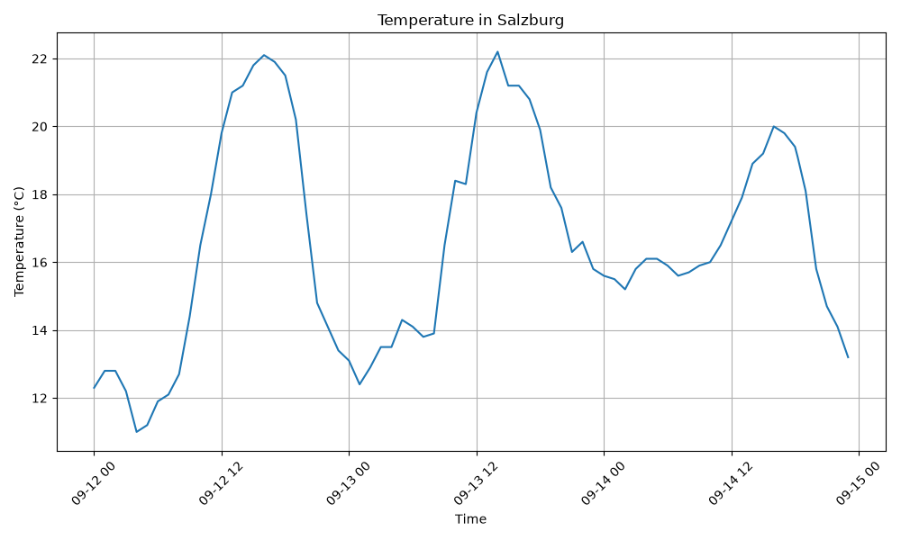
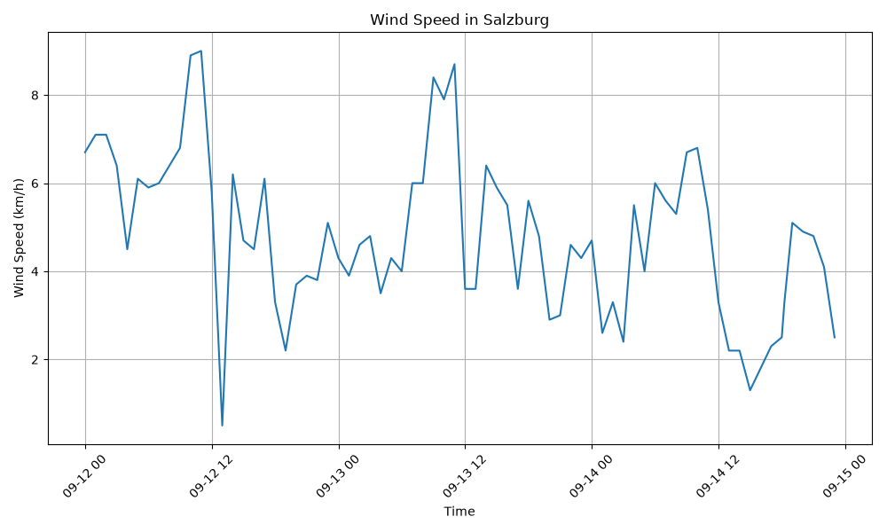

# Weather Data Pipeline

A Python data pipeline that retrieves weather data from the Open-Meteo API, stores the observations in a SQLite database and analyzes the collected data using SQL, pandas and matplotlib.

The project demonstrates a complete workflow from external API data to persistent storage, querying, analysis and visualization.

## Data Pipeline

```text
Open-Meteo API
      ↓
Python / requests
      ↓
JSON data
      ↓
SQLite database
      ↓
SQL queries
      ↓
pandas
      ↓
matplotlib
      ↓
CSV files & visualizations
```

## Technologies

- Python
- REST API
- requests
- SQLite
- SQL
- pandas
- matplotlib
- Git
- GitHub

## Features

- Retrieves current weather data from the Open-Meteo API
- Retrieves hourly weather data for Salzburg
- Stores observations in a SQLite database
- Prevents duplicate observations using a `UNIQUE` constraint
- Uses `INSERT OR IGNORE` for duplicate handling
- Performs SQL queries and statistical analysis
- Loads SQLite data into pandas
- Calculates daily weather statistics
- Generates temperature and wind-speed visualizations
- Exports daily summaries as CSV

## Database

Weather observations are stored in the following SQLite table:

```sql
CREATE TABLE weather_observations (
    id INTEGER PRIMARY KEY AUTOINCREMENT,
    time TEXT NOT NULL UNIQUE,
    temperature REAL NOT NULL,
    wind_speed REAL NOT NULL
);
```

The unique timestamp prevents duplicate observations from being stored.

## SQL Analysis

The project uses SQL operations including:

```sql
SELECT
WHERE
ORDER BY
LIMIT
COUNT()
AVG()
MIN()
MAX()
```

Example query for finding the five windiest observations:

```sql
SELECT
    time,
    temperature,
    wind_speed
FROM weather_observations
ORDER BY wind_speed DESC
LIMIT 5;
```

## Project Structure

```text
weather-data-pipeline/
├── data/
│   └── weather.db
├── output/
│   ├── daily-summary.csv
│   ├── temperature-history.png
│   └── wind-speed-history.png
├── src/
│   ├── main.py
│   ├── backfill.py
│   ├── query_data.py
│   ├── sql_insights.py
│   └── analyze_weather.py
├── README.md
├── requirements.txt
└── .gitignore
```

## Scripts

### `main.py`

Retrieves the current weather conditions and stores them in the SQLite database.

### `backfill.py`

Retrieves hourly weather observations and inserts only new observations into the database.

### `query_data.py`

Queries the database and calculates basic statistics using SQL.

### `sql_insights.py`

Performs filtered SQL queries such as:

- observations above 20 °C
- top five highest wind speeds
- number of observations above a defined temperature threshold

### `analyze_weather.py`

Loads data from SQLite into pandas, calculates statistics and generates visualizations and a daily CSV summary.

## Visualizations

### Temperature History



### Wind Speed History



## Installation

Clone the repository:

```bash
git clone https://github.com/kadirtoyran/weather-data-pipeline.git
cd weather-data-pipeline
```

Create a virtual environment:

```bash
python -m venv .venv
```

Install the required packages:

```bash
pip install -r requirements.txt
```

## Usage

Retrieve and store current weather data:

```bash
python src/main.py
```

Retrieve hourly observations:

```bash
python src/backfill.py
```

Run SQL queries:

```bash
python src/sql_insights.py
```

Run the pandas analysis and generate visualizations:

```bash
python src/analyze_weather.py
```

## Data Source

Weather data is provided by the Open-Meteo API.

Location used in this project:

**Salzburg, Austria**

## Possible Future Improvements

- Automate weather collection at scheduled intervals
- Add precipitation and humidity data
- Compare multiple cities
- Add interactive visualizations
- Build a dashboard
- Migrate the database from SQLite to PostgreSQL